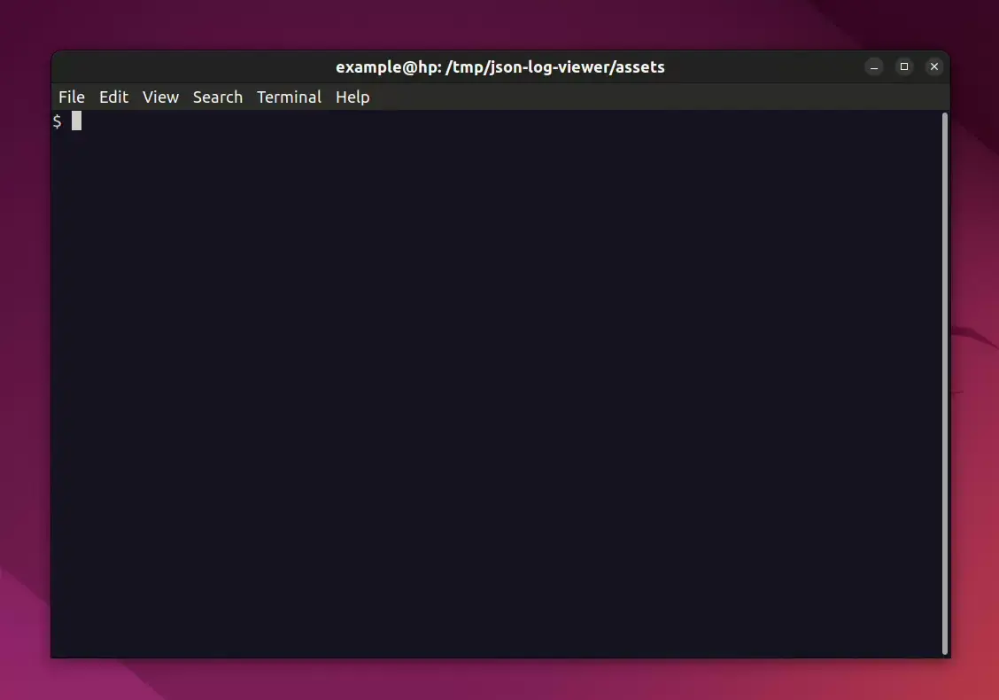

# JSON Log Viewer


[](https://goreportcard.com/report/github.com/hedhyw/json-log-viewer)
[](https://coveralls.io/github/hedhyw/json-log-viewer?branch=main)

It is an **interactive** tool for viewing and analyzing complex structured [json-log](assets/example.log) files.



Main features:
1. It is interactive.
2. It displays a compact list of log entries.
3. It is possible to expand the log and see the full prettified JSON tree.
4. All non-json logs are captured.
5. Fields are [customizable](#customization).
6. Filtering is easy to use.
7. Log levels are colorized.
8. Transforming numeric timestamps.

It uses [antonmedv/fx](https://github.com/antonmedv/fx) for viewing JSON records and [charmbracelet/bubbletea](https://github.com/charmbracelet/bubbletea) for organizing the terminal UI. The tool is inspired by the project [json-log-viewer](https://github.com/gistia/json-log-viewer) which is unfortunately outdated and deserted.

The application is designed to help in visualization, navigation, and analyzing of JSON-formatted log data in a user-friendly and interactive manner. It provides a structured and organized view of the JSON logs, making it easier to comprehend the hierarchical nature of the data. It uses collapsible/expandable tree structures, indentation, and color-coded syntax to represent the JSON objects and arrays. It is possible to search for specific keywords, phrases, or patterns within the JSON logs. So it helps to significantly simplify the process of working with JSON logs, making it more intuitive and efficient. It is easy to troubleshoot issues, monitor system performance, or gain a deeper understanding of the application's behavior by analyzing its log data in post-mortem.

## Table of content

- [JSON Log Viewer](#json-log-viewer)
    - [Table of content](#table-of-content)
    - [Usage](#usage)
    - [Install](#install)
        - [MacOS/Linux HomeBrew](#macoslinux-homebrew)
        - [Go](#go)
        - [Package](#package)
        - [Standalone Binary](#standalone-binary)
        - [Source](#source)
    - [Customization](#customization)
        - [Time Formats](#time-formats)
            - [`time`](#time)
            - [`numerictime`](#numerictime)
            - [`secondtime`](#secondtime)
            - [`millitime`](#millitime)
            - [`microtime`](#microtime)
    - [Resources](#resources)
    - [Contribution](#contribution)
    - [License](#license)

## Usage

```sh
jlv file.json
```

| Key    | Action         |
| ------ | -------------- |
| Enter  | Open/Close log |
| F      | Filter         |
| Ctrl+C | Exit           |
| F10    | Exit           |
| Esc    | Back           |
| ↑↓     | Navigation     |

> \[↑\] Click Up on the first row to reload the file.

## Install

### MacOS/Linux HomeBrew

```sh
brew install hedhyw/main/jlv
# jlv application.log
```

### Go

```sh
go install github.com/hedhyw/json-log-viewer/cmd/jlv@latest
# jlv application.log
```

### Package

Latest DEB and RPM packages are available on [the releases page](https://github.com/hedhyw/json-log-viewer/releases/latest).

### Standalone Binary

Download latest archive `*.tar.gz` for your target platform from [the releases page](https://github.com/hedhyw/json-log-viewer/releases/latest) and extract it to `/usr/local/bin/jlv`. Add this path to `PATH` environment.

### Source

```sh
git clone git@github.com:hedhyw/json-log-viewer.git
cd json-log-viewer
make build
cp ./bin/jlv /usr/local/bin
chmod +x /usr/local/bin/jlv

# jlv application.log
```

## Customization

The application will look for the config `.jlv.jsonc` in the working directory or in the home directory:
- `$PWD/.jlv.jsonc`;
- `$HOME/.jlv.jsonc`.

The Json path supports the described in [yalp/jsonpath](https://github.com/yalp/jsonpath#jsonpath-quick-intro) syntax.

Example configuration:
```jsonc
{
    // Comments are allowed.
    "fields": [
        {
            "title": "Time", // Max length is 32.
            // Kind affects rendering. There are:
            // * time;
            // * numerictime;
            // * secondtime;
            // * millitime;
            // * microtime;
            // * level;
            // * message;
            // * any.
            "kind": "numerictime",
            "ref": [
                // The application will display the first matched value.
                "$.timestamp",
                "$.time",
                "$.t",
                "$.ts"
            ],
            "width": 30
        },
        {
            "title": "Level",
            "kind": "level",
            "ref": [
                "$.level",
                "$.lvl",
                "$.l"
            ],
            "width": 10
        },
        {
            "title": "Message",
            "kind": "message",
            "ref": [
                "$.message",
                "$.msg",
                "$.error",
                "$.err"
            ],
            "width": 0 // The width will be calculated automatically.
        },
        {
            "title": "Custom",
            "kind": "any",
            "ref": [
                "$.custom"
            ],
            "width": 0
        },
    ],
    // Mapping of log level.
    // Possible values: none, trace, debug, info, warn, error, panic, fatal.
    "customLevelMapping": {
        // Replace "10" to "trace" in log level.
        "10": "trace",
        "20": "debug",
        "30": "info",
        "40": "warn",
        "50": "error",
        "60": "fatal"
    }
}
```

### Time Formats
JSON Log Viewer can handle a variety of datetime formats when parsing your logs.

#### `time`
This will return the exact value that was set in the JSON document.

#### `numerictime`
This is a "smart" parser. It can accept an integer, a float, or a string. If it is numeric (`1234443`, `1234443.589`, `"1234443"`, `"1234443.589"`), based on the number of digits, it will parse as seconds, milliseconds, or microseconds. The output is a UTC-based RFC 3339 datetime.

If a string such as `"2023-05-01T12:00:34Z"` or `"---"` is used, the value will just be carried forward to your column.  

If you find that the smart parsing is giving unwanted results or you need greater control over how a datetime is parsed, considered using one of the other time formats instead.

#### `secondtime`
This will attempt to parse the value as number of seconds and render as a UTC-based RFC 3339. Values accepted are integer, string, or float.

#### `millitime`
Similar to `secondtime`, this will attempt to parse the value as number of milliseconds. Values accepted are integer, string, or float.

#### `microtime`
Similar to `secondtime` and `millistime`, this will attempt to parse the value as number of microseconds. Values accepted are integer, string, or float.

## Resources

Alternatives:
- [mightyguava/jl](https://github.com/mightyguava/jl) - Pretty Viewer for JSON logs.
- [pamburus/hl](https://github.com/pamburus/hl) - A log viewer that translates JSON logs into human-readable representation.
- [json-log-viewer](https://github.com/gistia/json-log-viewer) - Powerful terminal based viewer for JSON logs using ncurses.

## Contribution

Check [open unassigned issues](https://github.com/hedhyw/json-log-viewer/issues), write comments, ask questions, fork, and create a pull request.

## License

[MIT License](LICENSE).
