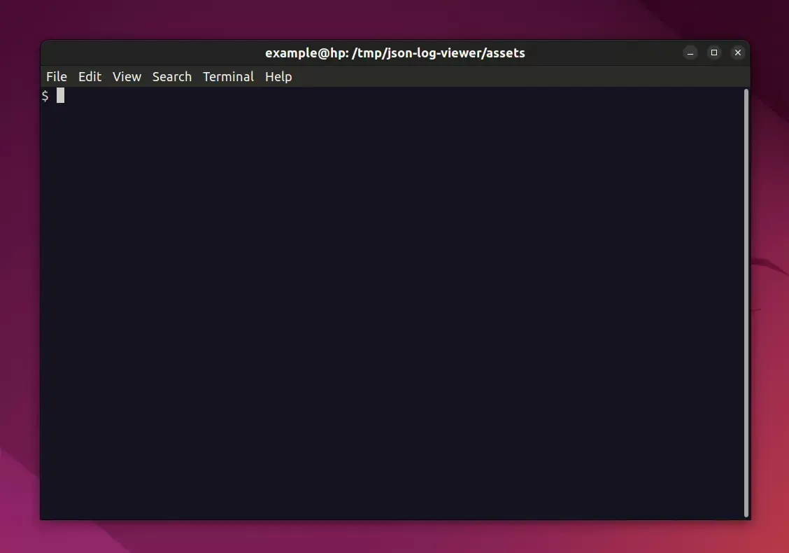

# JSON Log Viewer


[](https://goreportcard.com/report/github.com/hedhyw/json-log-viewer)
[](https://coveralls.io/github/hedhyw/json-log-viewer?branch=main)
[](https://github.com/avelino/awesome-go?tab=readme-ov-file#utilities)

An interactive tool for viewing and analyzing complex structured JSON logs.



## Installation

### Homebrew

```shell
brew install hedhyw/main/jlv
```

### Standalone Binary, DEB or RPM packages

https://github.com/hedhyw/json-log-viewer/releases/latest

## Quick start

```shell
# Open a log file.
jlv application.log

# Or read from stdin.
kubectl logs pod/my-pod -f | jlv
```

Press `?` inside the viewer to see all hotkeys, `F` to filter, `Enter` to
expand a log entry, and `Ctrl+C` to exit. See [usage](docs/usage.md) for
more examples.

## Documentation

- [Features](docs/features.md).
- [Install from source](docs/install-from-source.md).
- [Usage](docs/usage.md).
- [Customization](docs/customization.md).
- [Resources](docs/resources.md).
- [Contribution](docs/CONTRIBUTING).
- [MIT License](LICENSE).
